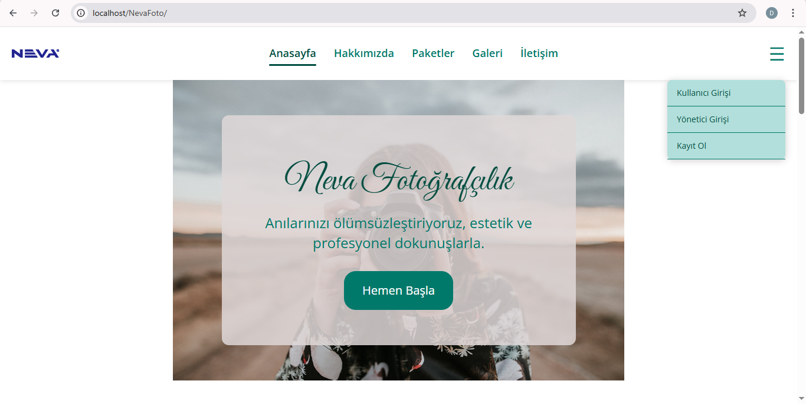
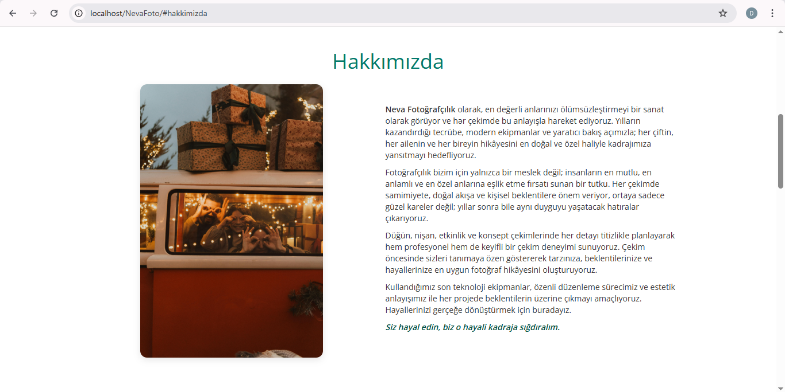
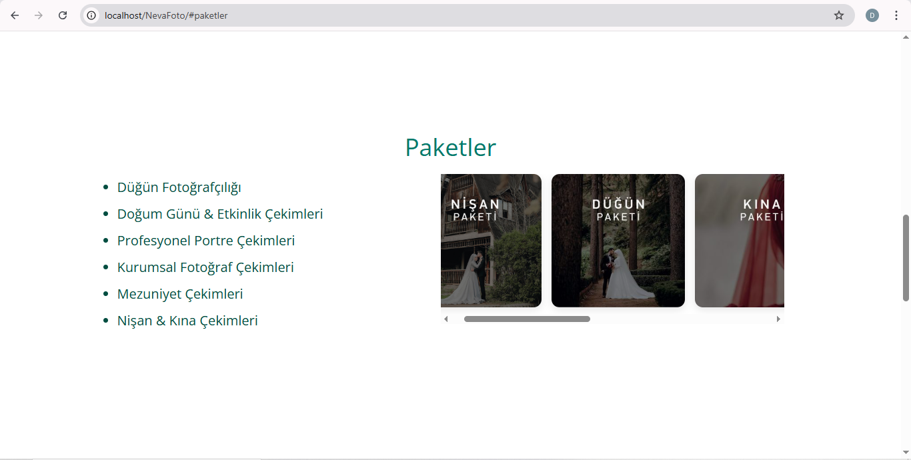
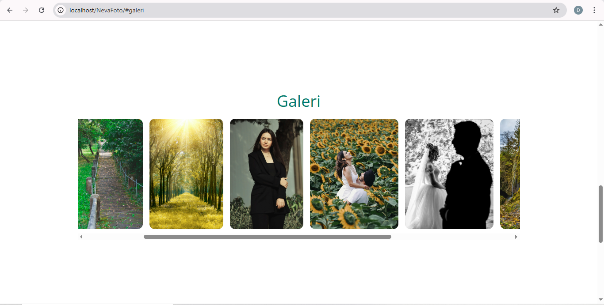
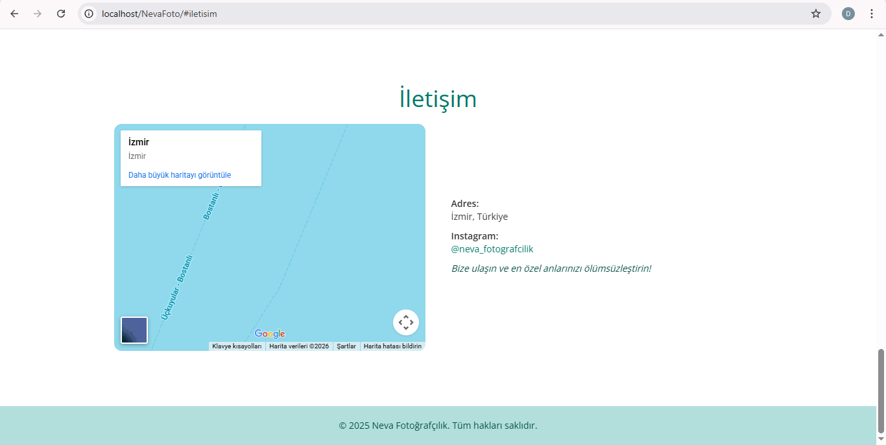

# 📸 Fotoğrafçı Randevu ve Yönetim Otomasyon Web Uygulaması

Web tabanlı, tam kapsamlı bir randevu ve yönetim otomasyon sistemidir.

Bu sistem sayesinde:

- 👤 Kullanıcılar online kayıt olabilir
- ✅ Yönetici onayı sonrası sisteme giriş yapabilir
- 📅 Randevu oluşturabilir
- 📦 Paket seçimi yapabilir
- ⏱ Çakışmasız randevu planlaması sağlanır
- 🛠 Yönetici tüm sistemi panel üzerinden kontrol edebilir

---

# 🚀 Kullanılan Teknolojiler

- PHP  
- MySQL  
- HTML5  
- CSS3  
- Bootstrap  
- JavaScript  
- jQuery  

---

# 🏠 Ana Sayfa (index.php)

### 🏠 Anasayfa











**Özellikler:**

- Responsive tasarım  
- Hamburger menü  
- Kullanıcı Girişi  
- Yönetici Girişi  
- Kayıt Ol  
- Hakkımızda bölümü  
- Paketler slider alanı  
- Galeri (Lightbox destekli)  
- İletişim ve Harita  

**Teknik Detaylar:**

- Galeri için özel Lightbox sistemi  
- Yatay scroll destekli paket ve galeri slider  
- Bootstrap 3.4.1 kullanıldı  
- Mobil uyumlu yapı  

---

# 👤 Kullanıcı Kayıt Sayfası

📷 screenshots/kayit.png

**Özellikler:**

- Ad Soyad  
- Telefon  
- E-posta  
- Şifre  
- Yönetici onayı gereklidir  

**Sistem Mantığı:**

1. Kullanıcı kayıt olur  
2. Durumu: Onay Bekliyor  
3. Yönetici panelinden onaylanır  
4. Onay sonrası giriş yapabilir  

---

# 🔐 Kullanıcı Giriş Sayfası

📷 screenshots/kullanici_girisi.png

**Özellikler:**

- E-posta  
- Şifre  
- Güvenli oturum başlatma  
- Onaylanmamış kullanıcı giriş yapamaz  

---

# 👩‍💼 Kullanıcı Paneli

📷 screenshots/kullanici_panel.png

**Kullanıcı İşlemleri:**

- Profil bilgilerini güncelleme  
  - Ad Soyad  
  - Telefon  
  - E-posta  
  - Şifre  
- Randevu oluşturma  
- Randevularımı görüntüleme  
- Çıkış yapma  

---

# 📅 Randevu Oluşturma Sistemi

📷 screenshots/randevu_olustur.png

**Randevu Özellikleri:**

- Tarih seçimi  
- Saat seçimi  
- Paket seçimi  
- Açıklama alanı  

**Akıllı Çakışma Kontrolü:**

- Paket süresi dikkate alınır  
- Yönetici onayladıktan sonra saat aralığı dolu olur  
- Aynı zaman aralığında başka kullanıcı randevu alamaz  
- Geçmiş tarih ve saat için randevu oluşturulamaz  

---

# 📋 Randevularım Sayfası

📷 screenshots/randevularim.png

**Görüntüleme Türleri:**

- Beklemede  
- Onaylandı  
- Reddedildi  
- Geçmiş randevular  
- Gelecek randevular  

---

# 🛠 Yönetici Giriş Sayfası

📷 screenshots/yonetici_girisi.png  

# 🖥 Yönetici Paneli

📷 screenshots/yonetici_panel.png

**Yönetici Yetkileri:**

- Kullanıcıları listeleme  
- Kullanıcı silme  
- Kullanıcı düzenleme  
- Randevuları onaylama / reddetme  
- Paket ekleme  
- Paket düzenleme  
- Paket silme  
- Paket aktif/pasif yapma  

---

# 📦 Paket Yönetim Sistemi

📷 screenshots/paketler.png

**Paket Alanları:**

- Paket Adı  
- Açıklama  
- Fiyat  
- Süre (dakika)  
- Aktif / Pasif durumu  

**Mantık:**

- Sadece aktif paketler kullanıcıya görünür  
- Paket süresi randevu çakışma kontrolünde kullanılır  

---

# 🗄 Veritabanı Yapısı (Örnek)

## Kullanıcılar Tablosu

| Alan | Açıklama |
|------|----------|
| id | Kullanıcı ID |
| ad_soyad | Ad Soyad |
| telefon | Telefon |
| email | Email |
| sifre | Hashlenmiş şifre |
| durum | Onay durumu |

## Paketler Tablosu

| Alan | Açıklama |
|------|----------|
| id | Paket ID |
| paket_adi | Paket adı |
| aciklama | Açıklama |
| fiyat | Fiyat |
| sure | Süre |
| aktif | 1/0 |

## Randevular Tablosu

| Alan | Açıklama |
|------|----------|
| id | Randevu ID |
| kullanici_id | Kullanıcı |
| paket_id | Paket |
| tarih | Tarih |
| saat | Saat |
| durum | Beklemede / Onaylandı / Reddedildi |

---

# 🔒 Güvenlik Özellikleri

- Oturum kontrolü (Session kontrolü)  
- Yetki bazlı sayfa erişimi  
- Onaysız kullanıcı giriş engeli  
- Geçmiş tarih kontrolü  
- Çakışma engelleme algoritması  

---

# 📱 Responsive Tasarım

- Mobil uyumlu  
- Tablet uyumlu  
- Masaüstü uyumlu  
- Hamburger menü  
- Esnek slider yapısı  

---

# 📂 Proje Klasör Yapısı

```
/assets
   /images
   /icon
/screenshots
index.php
kayit_ol.php
kullanici_girisi.php
yonetici_girisi.php
style.css
database.sql
```

---

# ⚙️ Kurulum

1. Projeyi klonlayın:  
```
git clone https://github.com/kullaniciadi/fotografci-randevu-otomasyon.git
```

2. Veritabanını içe aktarın  
3. `config.php` dosyasına veritabanı bilgilerinizi girin  
4. Localhost üzerinde çalıştırın  

---

# 🎯 Projenin Amacı

Bu proje:

- Gerçek hayata yönelik  
- Randevu planlama sistemli  
- Yetki bazlı giriş kontrollü  
- Yönetim paneli içeren  
- Çakışma engelleyen  
- Tam kapsamlı bir otomasyon örneğidir
